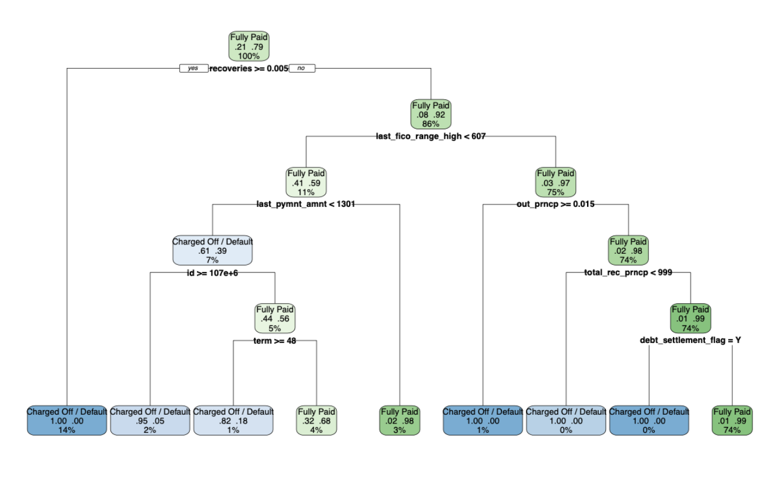
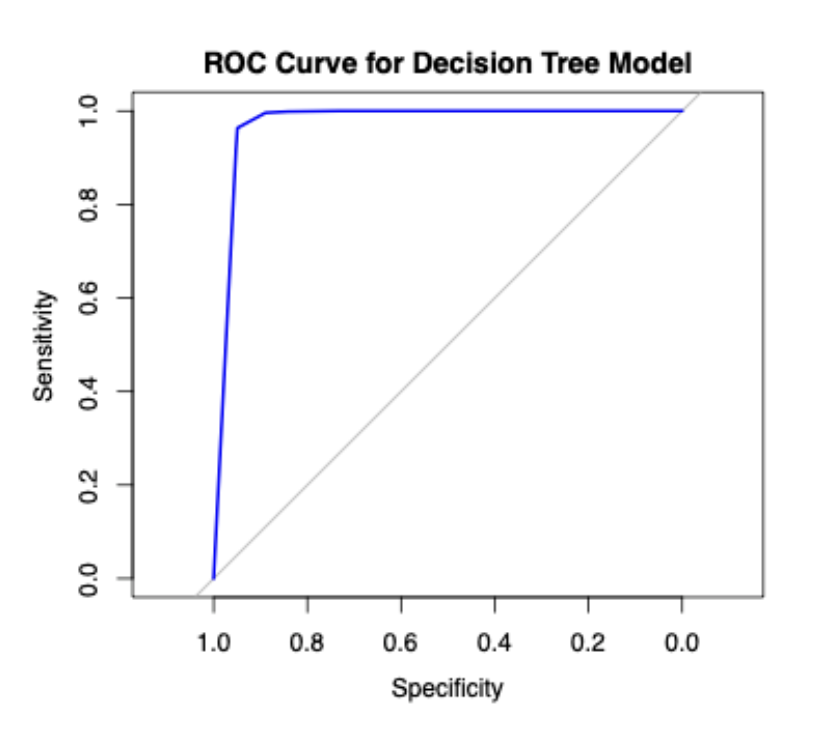
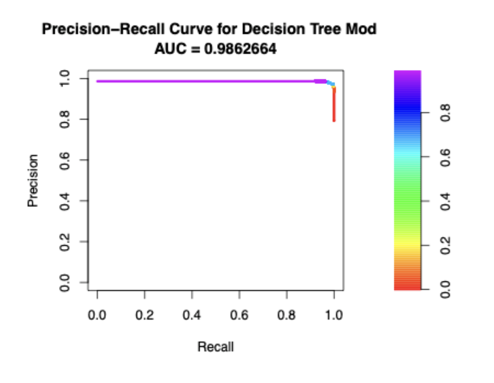

# Credit Risk Modeling in R

## Key Results

- Tree-based models (decision tree, random forest) outperformed logistic regression, indicating that borrower risk is driven by non-linear patterns that linear models fail to capture  
- Performance was consistent across cross-validation and holdout evaluation, with no observable degradation, indicating stable generalization  
- Predictive signal was concentrated in a small subset of financial and repayment-related variables, with most features contributing limited incremental explanatory value  
- ROC and Precision-Recall evaluation showed that accuracy was not an adequate metric under class imbalance and asymmetric error costs  
- A substantial portion of predictive power was driven by variables tied to repayment outcomes, introducing data leakage and limiting applicability in a forward-looking underwriting setting
  
---

## Approach

The objective was to classify loan outcomes using historical lending data and evaluate how different modeling approaches capture borrower risk. The dataset combined numeric and categorical financial variables along with operational fields that required removal before modeling.

Preprocessing involved dropping low-signal and non-generalizable columns, converting categorical variables to factors, and applying centering and scaling to numeric features. Consistency across training and validation splits was critical, particularly for factor levels and scaling parameters, to avoid instability in model behavior.

Three models were implemented: decision tree (CART), logistic regression, and random forest. Logistic regression provided a linear baseline but failed to capture interaction effects between borrower attributes. Decision trees modeled non-linear splits directly and produced interpretable decision rules. Random forest introduced additional flexibility through ensembling, but did not materially improve interpretability.

Evaluation was structured using 4-fold cross-validation on the working dataset, with a separate holdout set reserved for final testing. Cross-validation alone would overstate stability; separating the holdout set provided a more reliable estimate of generalization.

---

## Insights & Limitations

Predictive performance was driven by a limited number of high-signal variables, particularly those related to repayment behavior and credit quality. Default risk was not evenly distributed across features, and model performance depended on isolating these concentrated signals. The dominance of a small number of variables also suggests that feature redundancy is high, and that performance is driven more by a few high-signal predictors than by incremental gains across the full feature set.

Several high-importance variables were tied to post-origination repayment outcomes. These variables would not be available at the time of loan approval, introducing a clear data leakage risk in a production setting. Model performance in this project therefore reflects retrospective classification rather than a deployable underwriting model.

The modeling approach applies uniform treatment across variables and thresholds, which simplifies the problem but does not fully capture the differing impact of individual financial features.

Model selection therefore reflects a tradeoff between predictive flexibility and interpretability. Non-linear models improved predictive performance, while decision trees provided the most actionable structure for translating model outputs into risk-based decisions. Note: The project prioritizes interpretability and workflow design over model complexity, with an emphasis on understanding how modeling choices affect both performance and insight.

---

## Outputs

**Decision Tree (CART Model)**  

**ROC Curve**  

**Precision-Recall Curve**  

